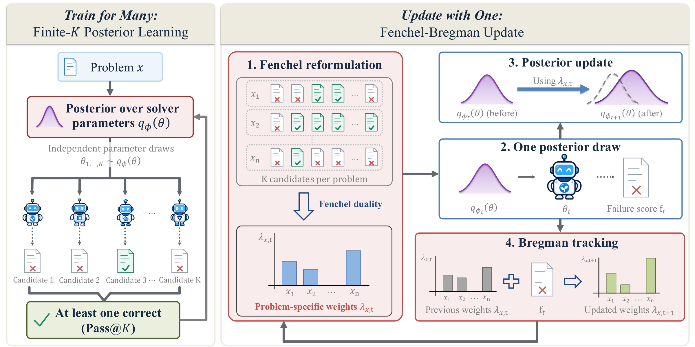

# Fenchel–Bregman Posterior Learning

Official implementation of **Train for Many, Update with One: Improving Multi-Sample Reasoning via Fenchel–Bregman Posterior Learning**.

👥 **Authors:** Sungjun Lim, Adrian Robert Minut, Nico Carlsen Daheim, Mohammad Emtiyaz Khan, Kyungwoo Song, and Thomas Möllenhoff.

📄 **arXiv:** Coming soon · 🌐 **Project page:** Coming soon

[🔍 Overview](#-overview) · [📊 Results](#-main-results) · [🚀 Quick start](#-quick-start) · [🧪 Reproduction](#-reproducing-experiments) · [📁 Code](#-code-layout) · [📚 Citation](#-citation)

---

## 🔍 Overview

Multi-sample reasoning succeeds when at least one of $K$ candidate solutions is correct, a quantity measured by Pass@$K$.
We formulate **finite-$K$ posterior learning** to train a distribution over solver parameters for the coverage of this candidate pool, rather than the average loss of individual attempts.



- 🎯 **Train for many (left):** Independent posterior parameter draws generate $K$ candidates, and training targets the probability that all $K$ candidates fail.

- ⚡ **Update with one (right):** An exact Fenchel reformulation separates problem-specific weights from the posterior update, enabling a weighted update with one posterior parameter draw.
  A closed-form Bregman update tracks these weights using an exponential running average of observed failures and reuses the same draw.

We call this optimization approach **Fenchel–Bregman (FB)** and instantiate it with IVON, a variational optimizer for Gaussian parameter posteriors, to obtain **Fenchel–Bregman IVON (FBI)**.
We evaluate FBI with recursive reasoning models and an autoregressive language model.

## 📊 Main results

The following results are reported in the paper; all values are percentages.
Pass@$K$ measures candidate coverage and is distinct from the accuracy of the final answer returned by a selector.

| Benchmark | Backbone | Metric | **FBI** |
| --- | --- | --- | --- |
| Sudoku-Extreme | TRM | Pass@10 | **99.55** |
| Maze-Hard | TRM | Pass@10 | **91.30** |
| ARC-AGI-1 | TRM | Pass@100 | **64.25** |
| ARC-AGI-2 | TRM | Pass@100 | **12.78** |
| Mathematical reasoning, five-benchmark mean | Qwen3-4B-Base | Pass@8 | **60.44** |

> ⚡ **Training efficiency**
>
> In a matched Maze-Hard comparison targeting $K_{\mathrm{train}}=10$, FBI achieves comparable mean Pass@10 to Direct-10 using **12.3% of its measured training time per update**.
> FBI uses one posterior parameter draw per update, while Direct-10 uses ten.

## 🚀 Quick start

**1️⃣ Clone the official repository**

```bash
git clone https://github.com/team-approx-bayes/Fenchel-Bregman.git
cd Fenchel-Bregman
```

**2️⃣ Install the dependencies**

Create a CUDA-enabled PyTorch environment and install the dependencies:

```bash
pip install -r requirements.txt
export PYTHONPATH="$PWD${PYTHONPATH:+:$PYTHONPATH}"
```

Each launcher reads a preprocessed dataset directory from `DATASET`.
Evaluation checkpoints come from `CHECKPOINT`.
FPRM checkpoints require the released `all_config.yaml` in the same directory as the checkpoint.
Download public FPRM files from [`fixed-point-reasoners/fprm`](https://huggingface.co/fixed-point-reasoners/fprm).

**3️⃣ Evaluate a Maze-Hard FBI checkpoint**

```bash
DATASET=/path/to/preprocessed-maze-hard \
CHECKPOINT=/path/to/fbi-checkpoint.pt \
OUTPUT_DIR=/path/to/output \
DEVICE=cuda:0 \
bash rrm/sh/maze_hard/fb.sh
```

> [!NOTE]
> This example requires a preprocessed dataset and a trained checkpoint supplied separately.
> For the autoregressive language model, use the separate environment and workflow in the [autoregressive reproduction guide](auto_lm/README.md).

## 🧪 Reproducing experiments

Use the launchers below for each benchmark; run them from the repository root.

| Experiment | Scripts / guide |
| --- | --- |
| Maze-Hard | [`rrm/sh/maze_hard/`](rrm/sh/maze_hard/) |
| Sudoku-Extreme | [`rrm/sh/sudoku_extreme/`](rrm/sh/sudoku_extreme/) |
| ARC-AGI-1 / ARC-AGI-2 baselines | [`rrm/sh/agi-1/`](rrm/sh/agi-1/) · [`rrm/sh/agi-2/`](rrm/sh/agi-2/) |
| Qwen3-4B-Base | [Autoregressive training and evaluation](auto_lm/README.md) |

Set `DATASET` and `CHECKPOINT` for evaluation; training launchers may also require `BASE_CHECKPOINT`.
See the [detailed reproduction guide](docs/reproduction.md) for method-specific commands, configuration options, and output files.

## 📁 Code layout

```text
Fenchel-Bregman/
├── fb.py                      # shared finite-K FB weighting and failure EMA
├── optim/
│   ├── ivon.py                # recursive-reasoning IVON adapter
│   └── fbi_ivon.py            # autoregressive-LM IVON implementation
├── auto_lm/
│   ├── fbi.py                 # autoregressive FBI objective and failure state
│   ├── run.py                 # training and posterior-evaluation entry point
│   ├── build_base_eval_suite.py
│   ├── prepare_generation_parquet.py
│   ├── aggregate_pass_at_k.py
│   └── MMPO/                  # vendored MMPO/verl runtime
└── rrm/
    ├── fprm.py                # fixed-point reasoning model
    ├── ptrm.py                # TRM and PTRM model
    ├── gram.py                # GRAM model
    ├── fbi.py                 # recursive-reasoning FBI objective and tracker
    ├── fenchel_bregman.py     # compatibility import for the previous API
    ├── train.py               # training entry point
    ├── evaluation.py          # evaluation and aggregation entry point
    ├── arc.py                 # ARC-AGI data, voting, and evaluation entry point
    ├── utils.py               # data and checkpoint utilities
    └── sh/                    # launchers
```

## 📚 Citation

Please cite the paper if you use this code.
The arXiv link and BibTeX entry will be added when the preprint is available.

## 🙏 Acknowledgments

The FPRM implementation follows [`nilskiKonjIzDunava/fprm`](https://github.com/nilskiKonjIzDunava/fprm).
The TRM and PTRM code follows [`SamsungSAILMontreal/TinyRecursiveModels`](https://github.com/SamsungSAILMontreal/TinyRecursiveModels).
The autoregressive runtime builds on [MMPO](https://github.com/e3trange/MMPO) and its vendored verl implementation.
The LM-specific IVON implementation derives from [ivon-opt](https://github.com/team-approx-bayes/ivon), with its license included in [`optim/IVON_LICENSE`](optim/IVON_LICENSE).
